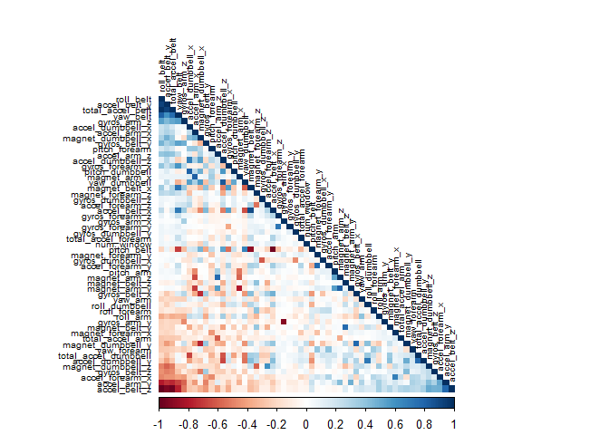

Goal
====

The goal of this project is to predict exercise execution by
incorporating machine learning. 6 participants were asked to perform
exercises either correctly (class: A) or with mistakes (classes: B, C,
D, E). Each participant was equipped with several accelerometers that
made measurements while they performed the exercises.

1. Loading packages and training data.
--------------------------------------

    library(plyr)
    library(tidyverse)
    library(caret)
    library(readr)
    library(corrplot)

    pml_training <- read_csv("H:/Kurse/DataScience/MachineLearning/Assignment1/pml-training.csv")
    pml_testing <- read_csv("H:/Kurse/DataScience/MachineLearning/Assignment1/pml-testing.csv")

2. Data cleaning
----------------

We remove columns that are not needed, especially those where the
variance is near zero. We also plot a correlation matrix.

    pml_training <- select(pml_training, 2:160)

    NZV <- nearZeroVar(pml_training)
    pml_training <- pml_training[, -NZV]

    NAS <- sapply(pml_training, function(x) mean(is.na(x))) > 0.95
    pml_training <- pml_training[, NAS==FALSE]

    pml_training1 <- select(pml_training, 5:58)
    pml_training1 <- na.exclude(pml_training1)

    corMatrix <- cor(pml_training1[,-54])
    corrplot(corMatrix, order = "FPC", method = "color", type = "lower", tl.cex = 0.6, tl.col = "black")

Dark colors indicate correlation (see right diagonal for perfect
correlation between the same parameters). There are only a few darks, no
further pre-processing will be conducted.

3. Setting up the cross validation parameters
---------------------------------------------

We divide the training data into 4 random parts (= number), where 3 will
be used to train the model and 1 will be used to test the model. This
will be done until each part was used for train and test. This will be
repeated 2 times ( = repeats), so the 4 parts will differ in their
composition between the 2 repeats.

    fitControl <- trainControl(
      method = "repeatedcv",
      number = 4,
      repeats = 2)

4. Setting up the models
------------------------

Based on the lecture we choose a gradient boosting algorithm first. They
normally offer good accuracy and don't take too long.

    gbm <- train(classe ~ ., data = pml_training, 
                   method = "gbm", 
                   trControl = fitControl,
                   na.action = na.pass,
                   verbose = FALSE)

    gbm

    ## Stochastic Gradient Boosting 
    ## 
    ## 19621 samples
    ##    57 predictor
    ##     5 classes: 'A', 'B', 'C', 'D', 'E' 
    ## 
    ## No pre-processing
    ## Resampling: Cross-Validated (4 fold, repeated 2 times) 
    ## Summary of sample sizes: 14717, 14716, 14717, 14716, 14717, 14716, ... 
    ## Resampling results across tuning parameters:
    ## 
    ##   interaction.depth  n.trees  Accuracy   Kappa    
    ##   1                   50      0.8343439  0.7898240
    ##   1                  100      0.8992712  0.8724198
    ##   1                  150      0.9264601  0.9068380
    ##   2                   50      0.9558914  0.9441566
    ##   2                  100      0.9864693  0.9828843
    ##   2                  150      0.9918969  0.9897506
    ##   3                   50      0.9837938  0.9794980
    ##   3                  100      0.9935786  0.9918779
    ##   3                  150      0.9971206  0.9963580
    ## 
    ## Tuning parameter 'shrinkage' was held constant at a value of 0.1
    ## 
    ## Tuning parameter 'n.minobsinnode' was held constant at a value of 10
    ## Accuracy was used to select the optimal model using  the largest value.
    ## The final values used for the model were n.trees = 150,
    ##  interaction.depth = 3, shrinkage = 0.1 and n.minobsinnode = 10.

The accuracy for the gbm model is 0.997, while the out of sample error
rate is below 1%. Based on their popularity, good performance and ease
of us, We choose a random forest algorithm for the second model.

    rf <- train(classe ~ ., data = pml_training1, 
                   method = "rf", 
                   trControl = fitControl)

    rf

    ## Random Forest 
    ## 
    ## 19621 samples
    ##    53 predictor
    ##     5 classes: 'A', 'B', 'C', 'D', 'E' 
    ## 
    ## No pre-processing
    ## Resampling: Cross-Validated (4 fold, repeated 2 times) 
    ## Summary of sample sizes: 14715, 14716, 14717, 14715, 14716, 14716, ... 
    ## Resampling results across tuning parameters:
    ## 
    ##   mtry  Accuracy   Kappa    
    ##    2    0.9958209  0.9947134
    ##   27    0.9979614  0.9974214
    ##   53    0.9957698  0.9946491
    ## 
    ## Accuracy was used to select the optimal model using  the largest value.
    ## The final value used for the model was mtry = 27.

The random forest model is even slightly better (accuracy: 0.998), than
the generalized boosted model, it took longer, however.

5. Prediction
-------------

Finally we use our best model (rf) to predict the test cases.

    pred <- predict(rf, newdata=pml_testing)
    print(pred)

    ##  [1] B A B A A E D B A A B C B A E E A B B B
    ## Levels: A B C D E
